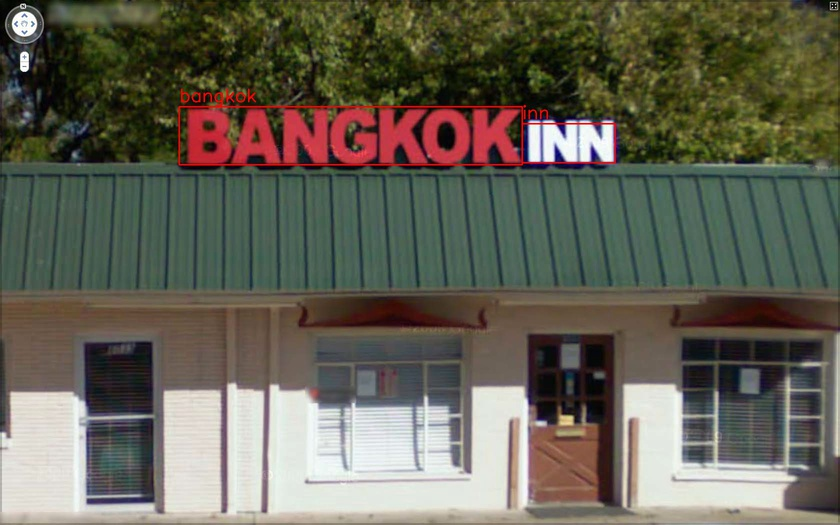

# DeepLetters

Deep learning based text detection and recognition using tensorflow.

DeepLetters consists of two convolutional networks.
* [SSD: Single Shot MultiBox Detector](https://arxiv.org/abs/1512.02325) for text detection
* [Convolutional Recurrent Neural Network](https://arxiv.org/abs/1507.05717) for text recognition

## results



## Training text detector

First you need to clone the tensorflow/models repository and download the pre-trained SSD model.

   ```
   $ git clone https://github.com/tensorflow/models.git
   $ cd models/research/object_detection
   $ wget http://download.tensorflow.org/models/object_detection/ssd_inception_v2_coco_2018_01_28.tar.gz
   $ tar zxvf ssd_inception_v2_coco_2018_01_28.tar.gz
   ```

After cloning the repository, you should append the tensorflow/models/research/ and slim directories to PYTHONPATH.

   ```
   # From tensorflow/models/research/
   $ export PYTHONPATH=$PYTHONPATH:`pwd`:`pwd`/slim
   ```

Then clone the DeepLetters repository and create symbolic link to tensorflow/models directory.

   ```
   $ git clone https://github.com/satojkovic/DeepLetters
   $ cd DeepLetters
   $ ln -s <OBJECT_DETECTION_API_DIR>/ssd_inception_v2_coco_2018_01_28 ssd_inception_v2_coco_2018_01_28
   ```

Before training text detector, you need to convert cocotext.v2.json and synthtext gt.mat into tfrecord format.

   ```
   # COCO dataset
   # Train
   $ python gen_coco_tfrecord.py --train_or_val train --cocotext_json <DATA_ROOT_DIR_PATH>/cocotext/cocotext.v2.json --coco_imgdir <DATA_ROOT_DIR_PATH>/COCO/images --output_path coco_train.tfrecord
   # Validation
   $ python gen_coco_tfrecord.py --train_or_val val --cocotext_json <DATA_ROOT_DIR_PATH>/cocotext/cocotext.v2.json --coco_imgdir <DATA_ROOT_DIR_PATH>/COCO/images --output_path coco_val.tfrecord

   # SynthText
   # Train and Test
   $ python gen_synthtext_tfrecord.py --gt_mat_path <DATA_ROOT_DIR_PATH>/SynthText/gt.mat
   ```

<DATA_ROOT_DIR_PATH> is the path to root directory of COCO and SynthText datasets.

Now, to start a new training job, type the following command.

   ```
   $ python <OBJECT_DETECTION_API_DIR>/legacy/train.py --logtostderr --pipeline_config_path=ssd_inception_v2.config --train_dir=training
   ```

## How to use

```csh
$ python deep_letters.py --input <input image or video> --detection_model_path <detection_model_pb> --detection_th <th> --recognition_model_path <recognition_model.pth>
```

Download detection model file (pb file) from [GoogleDrive](https://drive.google.com/open?id=1qXlfxkDdvW3dFS6NPZdC3VOmhb9DUsSf).

Clone [crnn.pytorch](https://github.com/meijieru/crnn.pytorch) repository and place it on same level with DeepLetters repository. (DeepLetters use crnn.pytorch to recognize texts in detection results)
